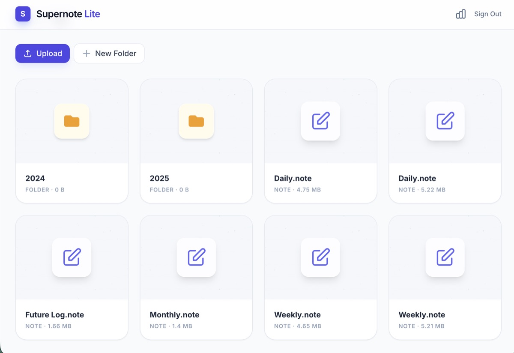
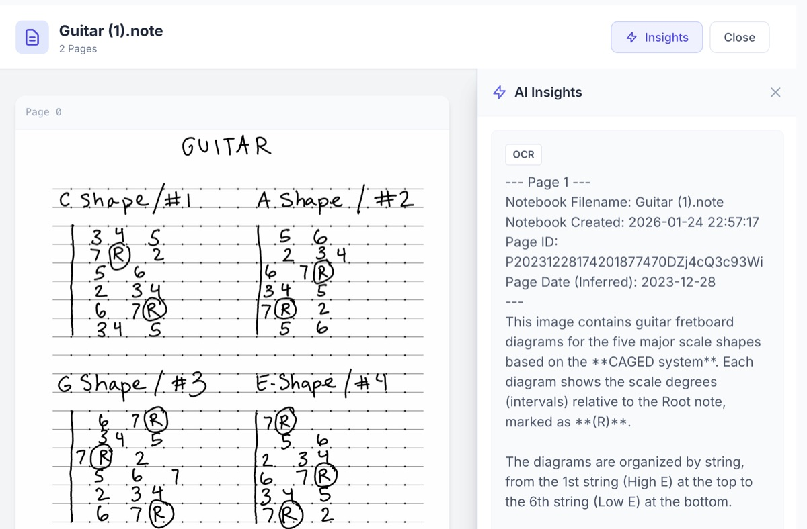
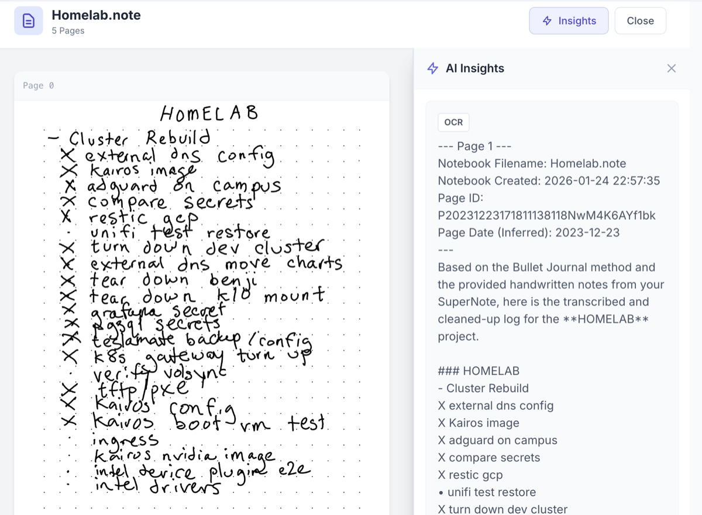
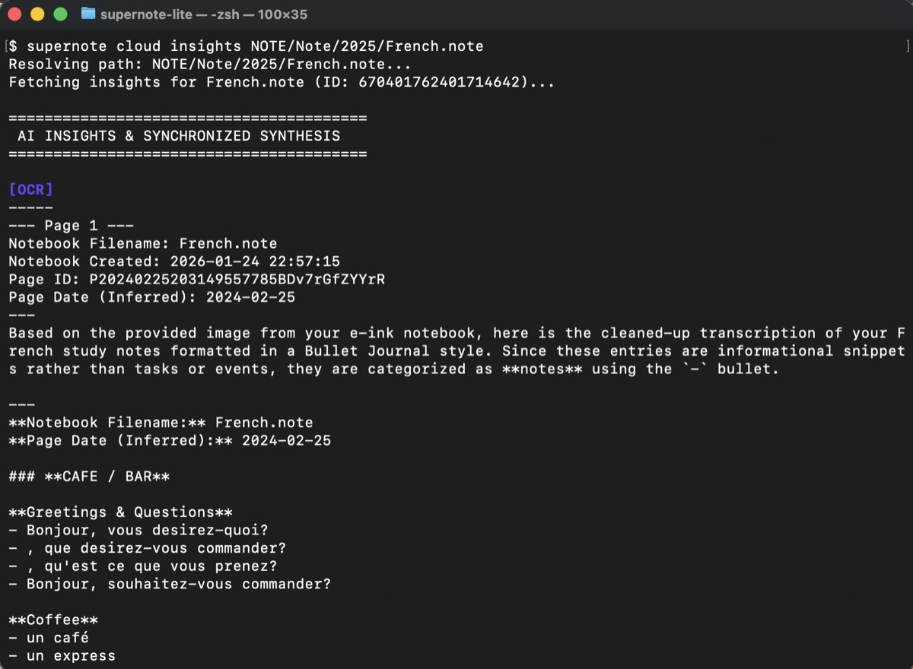
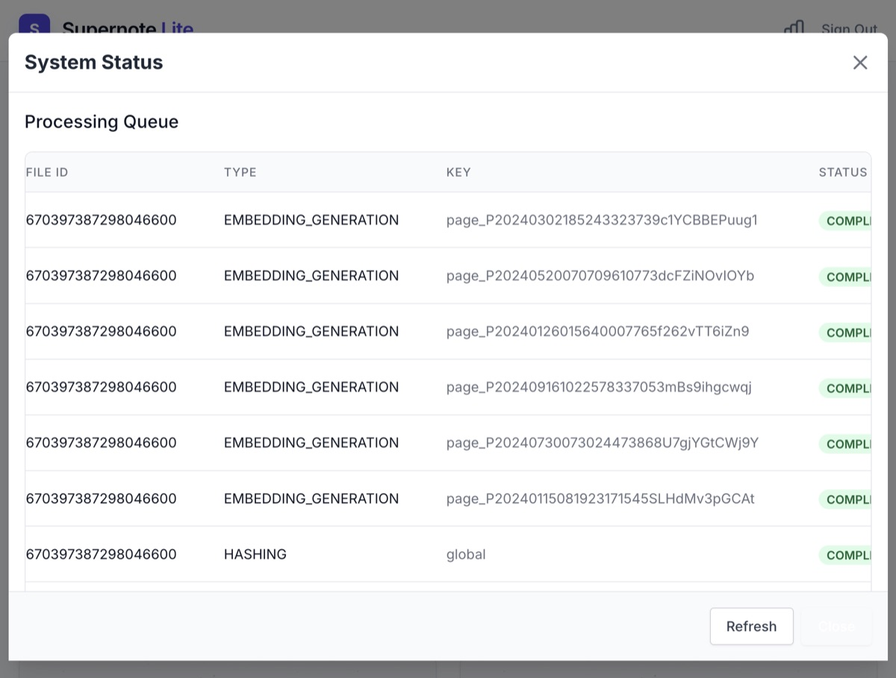
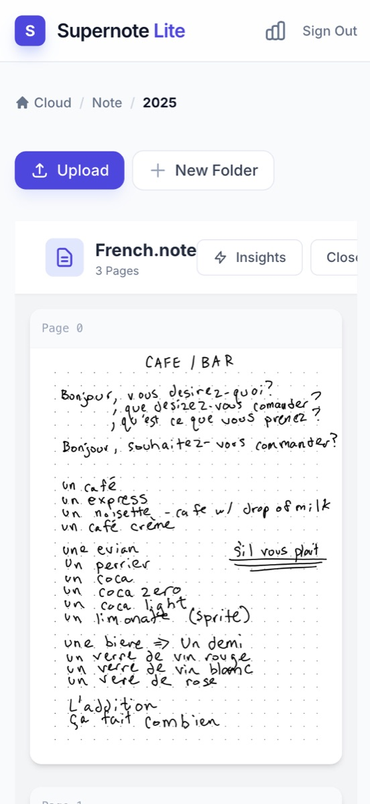

# supernote

**A private, AI-powered knowledge hub for your Supernote.**

Supernote Lite is a self-hosted implementation of the **Supernote Private Cloud** protocol. While Ratta's official private cloud provides a solid and reliable sync foundation, Supernote Lite extends that experience with an **AI-driven intelligence layer**—transforming your handwritten notes into structured, searchable knowledge using Google Gemini.

<p align="center">
  
</p>

[](https://allenporter.github.io/supernote-lite/)
[](LICENSE)

## Why Supernote Lite?

This project is designed to be **fully compatible** with the official Supernote Private Cloud protocol, while adding specialized features for knowledge workers and researchers:

- **📜 AI Synthesis**: Automatically transcribes handwriting and generates high-level summaries (Daily, Weekly, Monthly).
- **🔍 Semantic Search**: Find concepts across all your notebooks—not just filenames—using vectorized content.
- **🛡️ Private & Secure**: You own your database. Run it on your NAS, local PC, or a low-power server.
- **🖥️ Modern Web UI**: A sleek, reactive frontend to browse, review, and search your notes from any browser.
- **🤖 MCP Ready**: Connect your notes to AI agents (like Claude or ChatGPT) via the built-in [Model Context Protocol](https://modelcontextprotocol.io/) server.

## Synthesis & AI in Action

Beyond simple storage, Supernote Lite provides an active processing pipeline to increase the utility of your notes:

1.  **Sync**: Your device uploads `.note` files using the official Private Cloud protocol.
2.  **Transcribe**: The server extract pages and use Gemini Vision to OCR your handwriting.
3.  **Synthesize**: AI Analyzers review your journals to find tasks, themes, and summaries.
4.  **Index**: Every word is vectorized, enabling semantic search across your entire library.

### Web Interface

The integrated frontend allows you to review your notes and AI insights side-by-side.

<p align="center">
  
  
</p>

## Quick Start

### 1. Launch the Cloud

The easiest way to start is with the `all` bundle and a Gemini API key:

```bash
export SUPERNOTE_GEMINI_API_KEY="your-api-key"
pip install "supernote[all]"
supernote serve
```

### 2. Bootstrap Your User

```bash
# Create the initial admin account
supernote admin user add you@example.com --url http://localhost:8080

# Authenticate your CLI
supernote cloud login you@example.com --url http://localhost:8080
```

### 3. Connect Your Device

1. On your Supernote, go to **Settings > Sync > Private Cloud**.
2. Enter your server URL (e.g., `http://192.168.1.5:8080`).
3. Log in with the email and password you created in Step 2.
4. Tap **Sync** to begin processing your notes.

### 4. Explore Your Insights

Once your notes sync and process, you can view the AI synthesis from the terminal or browser:

```bash
# Get a high-level summary and transcription
supernote cloud insights /Notes/NOTE/Journal.note

# Semantic search across all notebooks
supernote cloud search "What were my project goals for February?"
```

<p align="center">
  
</p>

> [!TIP]
> **Semantic Search**: Supernote Lite doesn't just look for words—it understands concepts. Searching for "budget" will find notes about "expenses" or "money," even if the specific word isn't there.

## Features Deep Dive

- **Official Protocol Compatibility**: Implements the official **Supernote Private Cloud** protocol for seamless device synchronization. While Ratta's official service provides a robust and managed sync experience, this project allows for local data ownership and custom background processing.
- **Notebook Parsing**: Native, high-fidelity conversion of `.note` files to PDF, PNG, SVG, or plain text.
- **Developer API**: Modern `asyncio` client to build your own automation around Supernote data.
- **Observability**: Built-in request tracing and background task monitoring.

<p align="center">
  
  
</p>

## Installation

```bash
# Install specific components
pip install supernote              # Notebook parsing only
pip install supernote[server]      # + Private server & AI features
pip install supernote[client]      # + API Client

# Full installation (recommended for server users)
pip install supernote[all]
```

## Local Development Setup

To set up the project for development, please refer to the [Contributing Guide](docs/CONTRIBUTING.md).

### Parse a Notebook (Local)

```python
from supernote.notebook import parse_notebook

notebook = parse_notebook("mynote.note")
notebook.to_pdf("output.pdf")
```

The notebook parser is a fork and slightly lighter dependency version of [supernote-tool](https://github.com/jya-dev/supernote-tool). All credit goes to the original authors for providing an amazing low-level utility.

### Run with Docker

```bash
# Build & Run server
docker build -t supernote .
docker run -d -p 8080:8080 -v $(pwd)/storage:/storage supernote serve
```

See [Server Documentation](https://github.com/allenporter/supernote-lite/blob/main/supernote/server/README.md) for details.

### Developer API

Integrate Supernote into your own Python applications:

```python
from supernote.client import Supernote
# See library docstrings for usage examples
```


## CLI Usage

```bash
# Server & Admin
supernote serve                      # Start the cloud
supernote admin user list           # Manage your users

# AI Synthesis & Insights
supernote cloud insights /Note.note # View synthesis from CLI

# File Operations
supernote cloud ls /                # List remote files
supernote cloud download /Note.note # Download to local machine
```

## Notebook Operations (Local)

You can use the built-in parser outside of the cloud server:

```python
from supernote.notebook import parse_notebook

note = parse_notebook("journal.note")
note.to_pdf("journal.pdf") # Multi-layer PDF conversion
```

The notebook parser is a fork of the excellent [supernote-tool](https://github.com/jya-dev/supernote-tool) with updated dependencies and modern type hints.

## Contributing

We welcome contributions! Please see our [Contributing Guide](docs/CONTRIBUTING.md) for details on:
- Local development setup
- Project architecture
- Using **Ephemeral Mode** for fast testing
- AI Skills for agentic interaction

## Acknowledgments

This project is in support of the amazing [Ratta Supernote](https://supernote.com/) product and community. It aims to be a complementary, unofficial offering that is fully compatible with the official [Private Cloud protocol](https://support.supernote.com/Whats-New/setting-up-your-own-supernote-private-cloud-beta).

### Choosing Your Private Cloud Experience

The official Supernote Private Cloud by Ratta is a rock-solid, production-grade implementation of the protocol. Supernote Lite (this project) serves as a **community-driven extension** for users who need deep data analysis and advanced integrations.

| Capability | Official Private Cloud (Ratta) | Supernote-Lite (Community) |
|------------|-------------------------------|-----------------------------|
| **Core Sync** | ✅ Robust & Validated | ✅ Protocol Compatible |
| **AI Analysis** | Basic OCR (Device-side) | **Adv. OCR & Multi-stage Synthesis** |
| **Search** | Path/Filename | **Semantic Concept Search** |
| **Stack** | Java / Spring Boot | Python / Asyncio |
| **Focus** | Stability & Stability | Innovation & Extensibility |

**Supernote-Lite is a great fit if:**
- You want **AI-generated summaries** and insights from your notebooks.
- You want to perform **semantic searches** across your entire handwriting library.
- You want to integrate your notes into local scripts via a Python API or CLI.
- You want to use the **Model Context Protocol (MCP)** to expose your knowledge to AI agents.

## Community Projects

- [jya-dev/supernote-tool](https://github.com/jya-dev/supernote-tool) - Original parser foundation.
- [awesome-supernote](https://github.com/fharper/awesome-supernote) - Curated resource list.
- [sn2md](https://github.com/dsummersl/sn2md) - Supernote to text/image converter.
